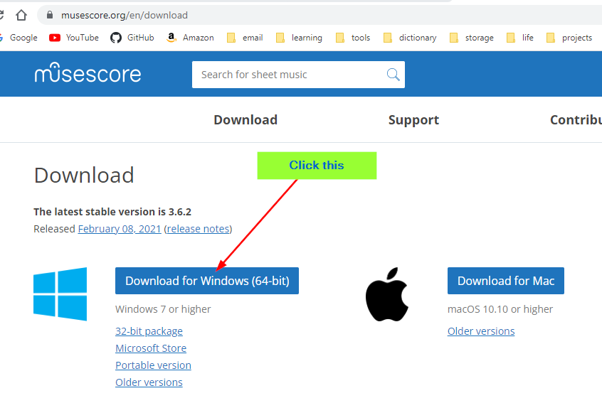
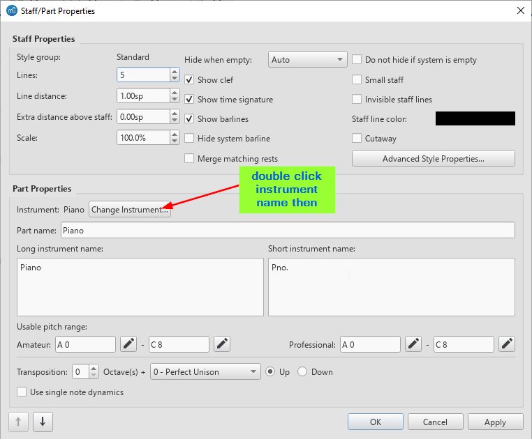
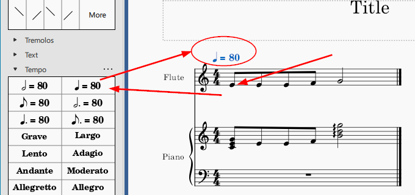
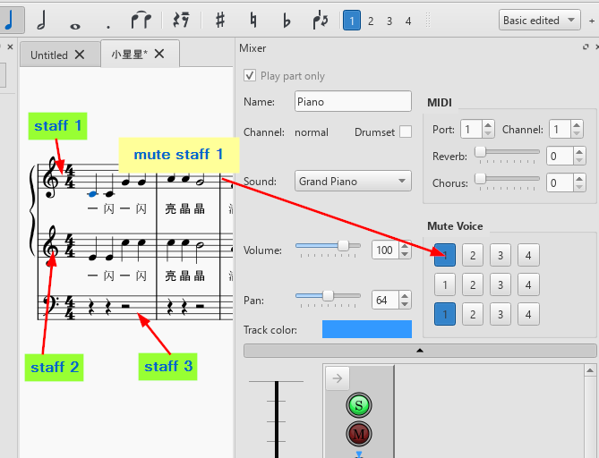
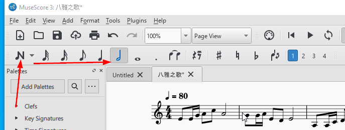
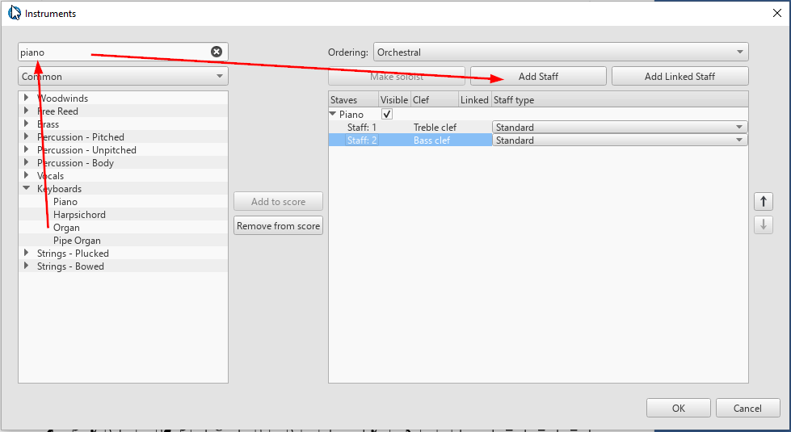

<h1>Muse Score Learning Notes</h1>

Click to see website: [Download MuseScore 3](https://musescore.org/en/download)

File name: MuseScore-3.6.2.548021803-x86_64.msi

- [修改乐器](#修改乐器)
- [Add Tempo](#add-tempo)
- [Key Transpose](#key-transpose)
- [Play one Staff](#play-one-staff)
- [Note Input](#note-input)
- [insert rest note](#insert-rest-note)
- [add measuers](#add-measuers)
- [delete measures](#delete-measures)
- [增加装饰音](#增加装饰音)
- [加入歌词](#加入歌词)
- [加入钢琴伴奏](#加入钢琴伴奏)

## 修改乐器
double click instrument name >> click Change Instrument button

## Add Tempo
select note >> click tempo

## Key Transpose
Tool >> Transpose

## Play one Staff
> F10 || View >> Mixer

## Note Input

> Press [N] on toolbar >> Select note >> click the location

## insert rest note
> Press [N] on toolbar >> Select note >> click the location >> press 0 || Right-click

## add measuers
> Add >> Measures >> Append Measures || Alt+shift+b

## delete measures

> Escape from note edit mode >> click first measure >> hold shift and click last measure >> Ctrl+Delete

## 增加装饰音
> Select the note >> click /

## 加入歌词
> Select the note >> Ctrl+L

## 加入钢琴伴奏
1. click [i]
2. 
