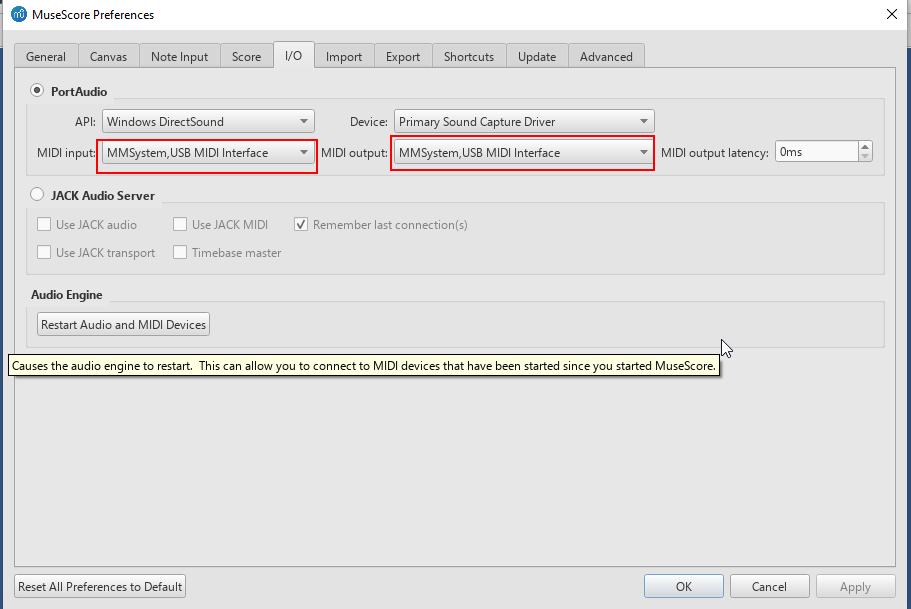
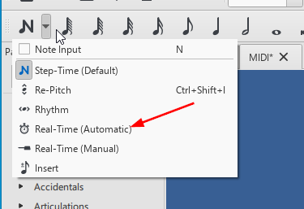

<h1>Muse Score Learning Notes</h1>

Click to see website: [Download MuseScore 3](https://musescore.org/en/download)

File name: MuseScore-3.6.2.548021803-x86_64.msi

- [MIDI input](#midi-input)
- [转调](#转调)
- [修改乐器](#修改乐器)
- [Add Tempo](#add-tempo)
- [Key Transpose](#key-transpose)
- [Play one Staff](#play-one-staff)
- [Note Input](#note-input)
- [insert rest note](#insert-rest-note)
- [add measuers](#add-measuers)
- [delete measures](#delete-measures)
- [增加装饰音](#增加装饰音)
- [加入歌词](#加入歌词)
- [加入钢琴伴奏](#加入钢琴伴奏)

## MIDI input
* Cable-IN 接电子琴OUT；Cable-OUT 接电子琴IN
* 
* 
* 确定toggle MIDI 图标选中
* 确定N选中
* 确定所要输入音符的位置选中
 
🔔💡 **Knowlodge Base**

👎😱❗️ 千万不要使用Toggle MIDI Input图标，否则需要关闭museScore重新打开了。

[MIDI INPUT REAL-TIME Musescore tutorial ](https://www.youtube.com/watch?v=off0LnIE4MM)

## 转调
* 方法一：
1. 使用 Key Signatures 改变调式。此时并没有改变音高；
2. Ctrl-A 选择所有的音符，手动改变音高。

* 方法二：
1. Ctrl-A 选择所有音符；
2. Tools >> Transpose >>

## 修改乐器
double click instrument name >> click Change Instrument button

## Add Tempo
select note >> click tempo

## Key Transpose
Tool >> Transpose

## Play one Staff
> F10 || View >> Mixer

## Note Input

> Press [N] on toolbar >> Select note >> click the location

## insert rest note
> Press [N] on toolbar >> Select note >> click the location >> press 0 || Right-click

## add measuers
> Add >> Measures >> Append Measures || Alt+shift+b

## delete measures

> Escape from note edit mode >> click first measure >> hold shift and click last measure >> Ctrl+Delete

## 增加装饰音
> Select the note >> click /

## 加入歌词
> Select the note >> Ctrl+L

## 加入钢琴伴奏
1. click [i]
2. 
