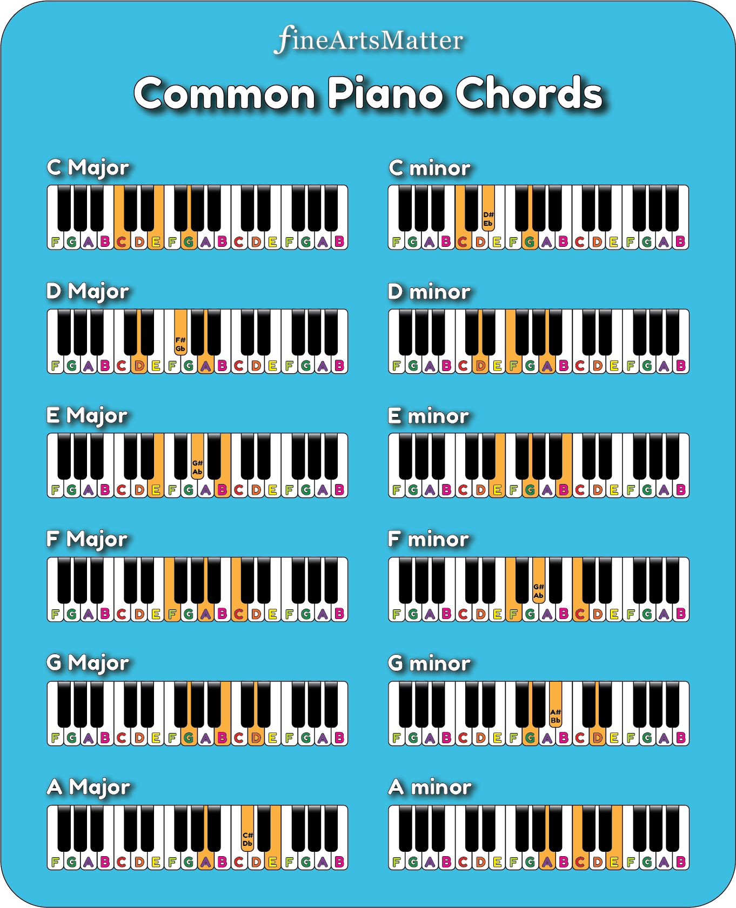
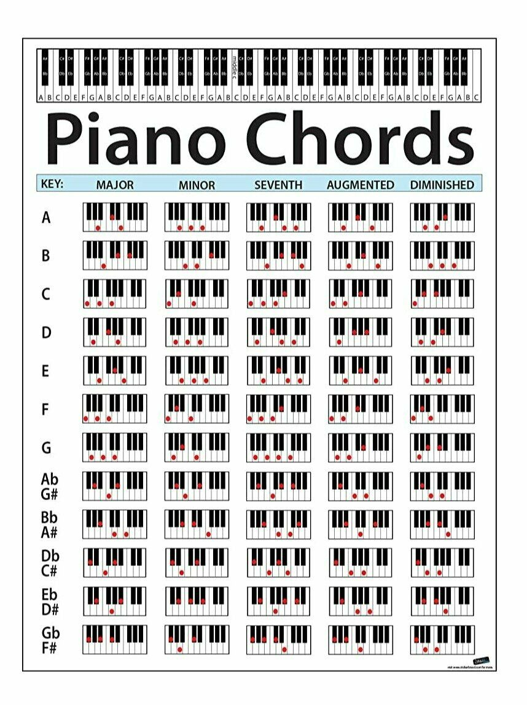

<h1>Learn Piano Notes</h1>

NetFlix: Asdfjkl1Net

## Piano Chords

🔔💡 **Knowlodge Base**
1. 按照唱名，1-3-5是大调(major)和弦，6-1-3是小调(minor)和弦
2. 按照琴键间隔，三键-两键是大调(major)和弦，两键-三键是小调(minor)和弦

## Ultimate Four Chords
* [Cheat sheet](The-ULTIMATE-Four-Chords-Cheat-Sheet.pdf)
* [C,G,Am,F](https://www.youtube.com/watch?v=1D3aWUx771A&t=2s)

## 顺接和弦

## 转位和弦
572=>725

## 根据主旋律找和弦
* [配和弦](https://www.youtube.com/watch?v=tqrgP-doNyU)

🔔💡 **Knowlodge Base**
> 根据节拍中音的强弱 
<u>33</u> <u>34</u> 5 - (3 和 5 是强拍)
135  725 

* [配和弦-1](sounds/配和弦1.mp3)

135 357 >> 135 3725

## 配和弦法则
[配和弦法则](https://www.youtube.com/watch?v=cLESaZyDKlU)
* 👍😄[好和弦](https://www.youtube.com/watch?v=I0y2LY4sPZA&list=PLmVjZfPp5kiNVtlRBphjzBUIH_Xa15h08)
* [一招配和弦](https://www.youtube.com/watch?v=tqrgP-doNyU)
* 😢[1645和弦即兴伴奏](https://www.youtube.com/watch?v=y-_oekyMsAA)
* 👍😄[6251-9和弦](https://www.youtube.com/watch?v=InRnUkIBvVs)

🔔💡 **Knowlodge Base**
1. 琴键的轻重；
2. 左手重复弹奏
3. 音乐律动走向6251
4. 左手keep 6 律动3 右手6713 >> 轮指^6713

🔔💡 **Knowlodge Base**
1. 旋律音在最高音

* 👍😄[分解和弦和指法](https://www.youtube.com/watch?v=OEpJZbGQ5kU)
🔔💡 **Knowlodge Base**

根五根    
大调音：1 5 1 5  和弦：1 3 5
左手指：5 2 1 2  右手：1 3 5

旋律走向：1 6 4 5

城南送别

* 👍😄[全分解伴奏织体教学《童话》16m45](https://www.youtube.com/watch?v=4KZ-6XaJtwE)

🔔💡 **Knowlodge Base**
左手52右手13531-左手2
音名15    13531    5