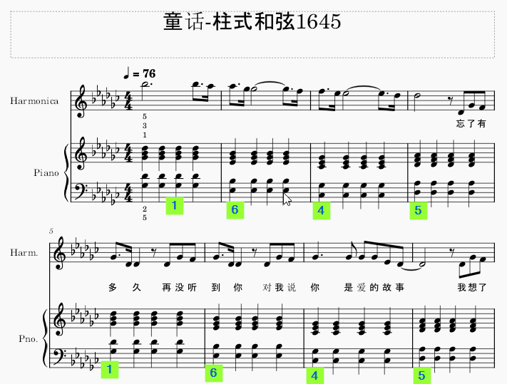

<h1>Learn Piano Notes</h1>

NetFlix: Asdfjkl1Net

1. 旋律
2. 节奏
3. 和声

多音色
即时控制器，摇杆，滚轮
音乐工作站

## 升降号
升号：4152637（4起始，隔一个升一个，第二个升5度）
降号：7362514（7起始，隔一个降一个，第二个降5度）

## 和声学

[和声学YouTube](https://www.youtube.com/watch?v=TO27YXJ75g4)

🔔💡 **Knowlodge Base**
```
主和弦Tonic：       i （CEG，135）， T 安详，稳重
属和弦Dominant：    V （GBD，572）， D 紧张
下属和弦Subdominat：IV (FAC，461)， S 明亮，上升
```
乐曲走向：T->S->D->T


T>S>T: 变格进行
T>D>T: 正格进行
T>S>D>T: 完整进行

副三和弦：(正三和弦的替换分身，提供色彩变化)
T: vi （大调）或 VI（小调）
D: vii（大调、小调和声小音阶）或VII（自然小音阶）
S: ii （大调）或 $ii^0$ （小调)


所谓的 1 6 4 5 1 就是 T t S D T


## 四部合唱编写 (Four Part Harmony)
各声部音域：男低音42  男高音16 女中音52 女高音16
👍😄[A Beginner's Guide to Four-Part Harmony](https://www.youtube.com/watch?v=GoUQ_WHCe48)

[How to Sing Harmony - Lesson and Exercises](https://www.youtube.com/watch?v=b6fu5B3XiIA)


🔔💡 **Knowlodge Base**
```
cadences: 节奏
V > I: Perfect cadences
IV > I: Plagal cadences
(I,ii,IV) > V: Imperfect cadences
V > VI: Interrupted
```
大局观：
1. 确定每小节的和弦
2. 选择乐句的开始和结束，确定使用I
3. 倒着从结束句，使用IV
4. 再从第二小节开始，按照照顾前后小节，


🔔💡 **Knowlodge Base**

⚡️所谓平行八度和平行五度是指音符走向。

## Piano Chords


🔔💡 **Knowlodge Base**
1. 按照唱名，1-3-5是大调(major)和弦，6-1-3是小调(minor)和弦
2. 按照琴键间隔，三键-两键是大调(major)和弦，两键-三键是小调(minor)和弦
3. 按照音程关系, 大三度+小三度 为大调和弦，小三度+大三度 为小调和弦
4. 升调号顺序：FCGDAEB 》4152637 （完全五度）
5. 降调号顺序：BEADGCF 》7362514
6. 升调号推调名：最后一个升号的音名向上推半音就是该调的调号：#F > G 大调；#E > #F 大调； ...
7. 调名推调号：调名向下半音得到调号最后一个升号的音名，按照升调顺序逐次写下升号，听着这个音名上。
8. 降调号推调名：倒数第二个降记号的音名就是调名，一个降号是F大调。


## Ultimate Four Chords
* [Cheat sheet](The-ULTIMATE-Four-Chords-Cheat-Sheet.pdf)
* [C,G,Am,F](https://www.youtube.com/watch?v=1D3aWUx771A&t=2s)

## 顺接和弦

## 转位和弦
572=>725

## 根据主旋律找和弦
* [配和弦](https://www.youtube.com/watch?v=tqrgP-doNyU)

🔔💡 **Knowlodge Base**
> 根据节拍中音的强弱 
<u>33</u> <u>34</u> 5 - (3 和 5 是强拍)
135  725 


* [配和弦-1](sounds/配和弦1.mp3)

135 357 >> 135 3725


## 配和弦法则
[配和弦法则](https://www.youtube.com/watch?v=cLESaZyDKlU)
* 全曲第一个和最后一个和弦135
* 全曲倒数第二个和弦572
* 只能用135 接 361 接 572
* 572 不能接 461
* 和弦尽量有变化，用过的不要再重复使用
* 相邻和弦有共同音，461 接 572 例外


* 👍😄[好和弦](https://www.youtube.com/watch?v=I0y2LY4sPZA&list=PLmVjZfPp5kiNVtlRBphjzBUIH_Xa15h08)

🔔💡 **Knowlodge Base**
1. 使用唱名比较容易搞定和弦。
2. 三和弦Triad，四个音七和弦，五个音九和弦，六个音11和弦，七个音13和弦
3. 七和弦的大调音阶为大和弦，降3降7为小和弦，只降7为属7和弦
4. 大和弦家族：C, Cmaj7, Cmaj9, Cmaj11, Cmaj13
5. 小和弦家族：Cm, Cm7, Cm9, Cm11, Cm13
6. 属和弦家族：C7, C9, C11, C13
7. 增加音add：Cadd2, Cadd6, Cadd4
8. 替代音sub: Csus4, Csus2, C7sus，用2，4换掉3
9. 省略音omit: Cmaj9(omit3)
10. 升降音（）: Cmaj9(#5), C7(b9), Cmaj13(#11), C7(#9, #11, b13)
11. 转位：C/E, C on E, 以E为根音。C/F，在135中外加4作为根音


* [一招配和弦](https://www.youtube.com/watch?v=tqrgP-doNyU)
* 😢[1645和弦即兴伴奏](https://www.youtube.com/watch?v=y-_oekyMsAA)
* 👍😄[6251-9和弦](https://www.youtube.com/watch?v=InRnUkIBvVs)

🔔💡 **Knowlodge Base**
1. 琴键的轻重；
2. 左手重复弹奏
3. 音乐律动走向6251
4. 左手keep 6 律动3 右手6713 >> 轮指^6713


[](https://www.youtube.com/watch?v=GexntVul938)
🔔💡 **Knowlodge Base**
1. 旋律音在最高音


* 👍😄[分解和弦和指法](https://www.youtube.com/watch?v=OEpJZbGQ5kU)
🔔💡 **Knowlodge Base**

## 根五根    
大调音：1 5 1 5  和弦：1 3 5 
左手指：5 2 1 2  右手：1 3 5


## 定音
左手定音，右手跟进
```
1. 左手5，2指之间相隔六个键（无论哪个调）
2. 右手1指与左手5指是同一个键的高8度
3. 右手5指与左手2指是同一个键的高8度
4. 右手3指决定大调，或小调音阶
5. 1，3指之间隔两键为小调
6. 1，3指之间隔三键为大调
```

## 旋律走向：1 6 4 5
* 柱式和弦

```
第一组1和弦同时按下：
1. 左手5指bG黑键，2指bD黑键
2. 右手1指高八度bG，5指高八度bD
3. 右手3指bB黑键，与1指隔三建

第二组6和弦同时按下：
1. 左手5指bE黑键，2指bB黑键
2. 右手1指高八度bE，5指高八度bB
3. 右手3指bG黑键，与1指隔三建 (小调)

第三组4和弦同时按下：
1. 左手5指B白键，2指bG黑键
2. 右手1指高八度B，5指高八度bG
3. 右手3指bE黑键，与1指隔三建 (大调)

第四组5和弦同时按下：
1. 左手5指bG黑键，2指bA黑键
2. 右手1指高八度bG，5指高八度bA
3. 右手3指F白键，与1指隔三建 (大调)

```


```
第一组1和弦同时按下：
1. 左手5指F白键，2指C白键
2. 右手1指高八度F，5指高八度C
3. 右手3指A白键，与1指隔三建

第二组6和弦同时按下：
1. 左手5指D白键，2指A白键
2. 右手1指高八度D，5指高八度A
3. 右手3指A键，与1指隔三建 (小调)

第三组4和弦同时按下： （与bG 大调的4和弦完全相同？）
1. 左手5指B白键，2指bG黑键
2. 右手1指高八度B，5指高八度bG
3. 右手3指bE黑键，与1指隔三建 (大调)

第四组5和弦同时按下：（与bG 大调的4和弦完全相同？）
1. 左手5指bG黑键，2指bA黑键
2. 右手1指高八度bG，5指高八度bA
3. 右手3指F白键，与1指隔三建 (大调)

```

* 👍😄[全分解伴奏织体教学《童话》16m45](https://www.youtube.com/watch?v=4KZ-6XaJtwE)

🔔💡 **Knowlodge Base**
左手52右手13531-左手2
音名15    13531    5