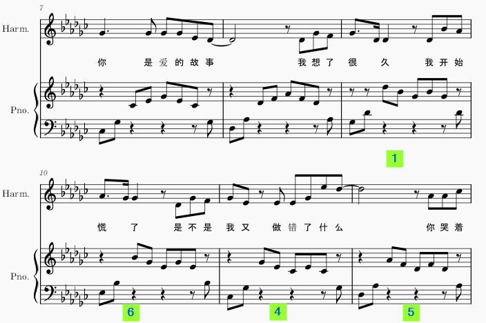

# 分解和弦

## 定音
**左手定音，右手跟进**
```
1. 左手5，2指之间相隔六个键（无论哪个调）
2. 右手1指与左手5指是同一个键的高8度
3. 右手5指与左手2指是同一个键的高8度
4. 右手3指决定大调，或小调音阶
5. 1，3指之间隔二键为小调
6. 1，3指之间隔三键为大调
```

## 旋律走向：1 6 4 5
**分解和弦**
1. 左右手轮指


```
左手5 2 右手 1 3 5 3 1 左手 2
乐感：1 5 1 3 5 3 1 5； 6 3 6 1 3 1 6 3；4 1 4 6 1 6 4 1；5 2 5 7 2 7 5 2
```

2. 右手先下行


```
左手5 2 右手 5 3 1 3 1 左手 2
乐感：1 5 5 3 1 3 1 5； 6 3 3 1 6 1 6 3；4 1 1 6 4 6 4 1；5 2 2 7 5 7 5 2
```

3. 右手只弹三音


```
左手5 2 右手 1 3 5 _ _ 左手 _
乐感：1 5 1 3 5 0 0 0； 6 3 6 1 3 0 0 0；4 1 4 6 1 0 0 0；5 2 5 7 2 0 0 0
```

4. 中间两音省略


```
左手5 2 右手 1 3 _ _ 1 左手 2
乐感：1 5 1 3 0 0 1 5； 6 3 6 1 0 0 6 3；4 1 4 6 0 0 4 1；5 2 5 7 0 0 5 2
```
