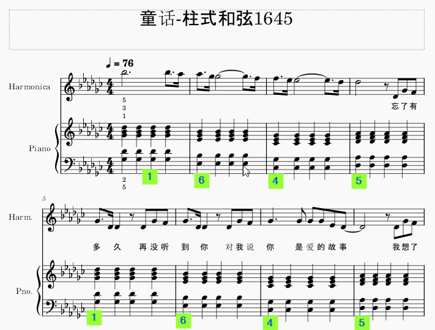
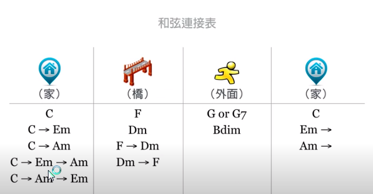

# 柱式和弦

## 定音
左手定音，右手跟进
```
1. 左手5，2指之间相隔六个键（无论哪个调，中间三个白键三个黑键，或者四个白键两个黑键）
2. 右手1指与左手5指是同一个键的高8度
3. 右手5指与左手2指是同一个键的高8度
4. 右手3指决定大调，或小调音阶
5. 1，3指之间隔二键为小调
6. 1，3指之间隔三键为大调
```

## 旋律走向：1 6 4 5
* 柱式和弦

```
第一组1和弦同时按下：
1. 左手5指bG黑键，2指bD黑键
2. 右手1指高八度bG，5指高八度bD
3. 右手3指bB黑键，与1指隔三建

第二组6和弦同时按下：
1. 左手5指bE黑键，2指bB黑键
2. 右手1指高八度bE，5指高八度bB
3. 右手3指bG黑键，与1指隔二建 (小调)

第三组4和弦同时按下：
1. 左手5指B白键，2指bG黑键
2. 右手1指高八度B，5指高八度bG
3. 右手3指bE黑键，与1指隔三建 (大调)

第四组5和弦同时按下：
1. 左手5指bG黑键，2指bA黑键
2. 右手1指高八度bG，5指高八度bA
3. 右手3指F白键，与1指隔三建 (大调)

```

## F 大调
```
第一组1和弦同时按下：
1. 左手5指F白键，2指C白键
2. 右手1指高八度F，5指高八度C
3. 右手3指A白键，与1指隔三建

第二组6和弦同时按下：
1. 左手5指D白键，2指A白键
2. 右手1指高八度D，5指高八度A
3. 右手3指F白键，与1指隔二建 (小调)

第三组4和弦同时按下：
1. 左手5指bB黑键，2指F白键
2. 右手1指高八度bB，5指高八度F
3. 右手3指D白键，与1指隔三建 (大调)

第四组5和弦同时按下：（与C 大调的1和弦完全相同？）
1. 左手5指C白键，2指G白键
2. 右手1指高八度C，5指高八度G
3. 右手3指E白键，与1指隔三建 (大调)

```

[👍😄 家>桥>外面>家](https://www.youtube.com/watch?v=sg2Jey-vwG0)
C(Em,Am)>F(Dm)>G(G7)

物理学原理：低谷（稳定）<>中能（亚稳）>高能（不稳）>>稳定
稳定>不稳>稳定