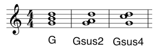
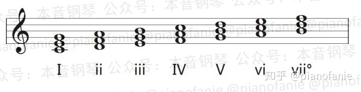
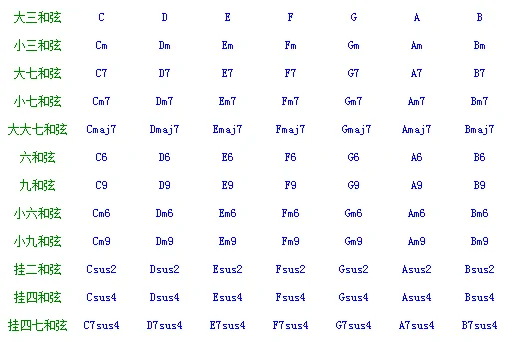

## 练习键盘和声
[十分鐘鍵盤和聲練習](https://www.youtube.com/watch?v=61lMcsLVo4k)
* 从简单的开始：1451 - 14151 》I>IV>I>V>I
* I > IV 右手保持1指不变，同时向右移动35指一个键位。左手保持5指不变，同时向右移动21指。

[键盘和声与即兴伴奏](https://zhuanlan.zhihu.com/p/34738180)
* 基于和弦音
* 基于强拍音(以及和弦走向)
* 基于多数音
* 基于相邻小节的和弦关系（主>属| 属>主 | 主>属>主 | 主>属七 | 属七>主 | 主>属七>主|）
* 基于旋律分组
* 基于歌曲的旋律发展

[即兴伴奏](https://www.zhihu.com/search?hybrid_search_extra=%7B%22sourceType%22%3A%22answer%22%2C%22sourceId%22%3A42544969%7D&hybrid_search_source=Entity&q=%E5%8D%B3%E5%85%B4%E9%85%8D%E5%92%8C%E5%A3%B0&search_source=Entity&type=content)

1>6 | 1>5 | 1>3 | 1>4
6>2 | 6>4 |
3>6 |
4>5 |
5>3 | 5>1 终止|

[和弦编配基本思路](https://zhuanlan.zhihu.com/p/101023548)
[钢琴即兴伴奏和弦公式简单整理](https://zhuanlan.zhihu.com/p/136370739)
钢琴即兴伴奏和弦公式简单整理
佛公子
佛公子
一个音乐专业毕业却喜欢收集各种有趣知识的理财小生。
14 人赞同了该文章
序号 和弦标记 和弦名称 和弦内音 和弦公式
1 C 大三和弦 135 大三度+小三度
2 Cm 小三和弦 1b35 小三度+大三度
3 C-5 大三减五和弦 13b5 大三度+增二度
4 C+5,C+,Cang 增和弦 13#5 大三度+大三度
5 Cdim,C-,C° 减和弦 1b3b56 小三度+小三度+小三度
6 Csus4,Csus 挂四和弦 145 纯四度+大二度
7 C6 大六和弦 1356 大三和弦+大二度
8 Cm6 小六和弦 1b356 小三和弦+大二度
9 C7 七和弦 135b7 大三和弦+小三度
10 Cmaj7,CM7 大七和弦 1357 大三和弦+大二度
11 Cm7 小七和弦 1b35b7 小三和弦+小三度
12 Cm#7 小升七和弦 1b357 小三和弦+大二度
13 C7+5,C7#5 七增五和弦 13#5b7 增和弦+大二度
14 C7-5,C7b5 七减五和弦 13b5b7 大三减五和弦+大三度
15 Cm7-5 ,Cm7b5 小七减五和弦 1b3b5b7 减三和弦+大三度
16 C7sus4 七挂四和弦 135b74 七和弦+纯四度
17 C7/6 七六和弦 135b76 七和弦+大六度
18 Cm79 大七九和弦 13572 大七和弦+小三度
19 Cmaj9,CM9 大九和弦 13572 大七和弦+小三度
20 C9 九和弦 135b72 七和弦+大三度
21 C9+5 九增五和弦 13#5b72 七增五和弦+大三度
22 C9-5 九减五和弦 13b5b72 七减五和弦+大三度
23 Cm9 小九和弦 1b35b72 小七和弦+大三度
24 C7+9 七增九和弦 135b7#2 七和弦+纯四度
25 Cm9#7 小九增七和弦 1b3572 小升七和弦+小三度
26 C7b9 七减九和弦 135b7b2 七和弦+小三度
27 C7-9+5 七减九增五和弦 13#5b7b2 七增五和弦+小三度
28 C7-9-5 七减九减五和弦 13b5b7b2 七减五和弦+小三度
29 C69 六九和弦 13562 大六和弦+纯四度
30 Cm69 小六九和弦 1b3562 小六和弦+纯四度
31 C11 十一和弦 135b724 九和弦+小三度
32 Cm11 小十一和弦 1b35b724 小九和弦+小三度
33 C11+ 九增十一和弦 135b72#4 九和弦+大三度
34 C13 十三和弦 135b7246 十一和弦+大三度
35 C13-9 十三减九和弦 135b7b246 七减九和弦+大三度+大三度
36 C13-9-5 十三减九五和弦 13b5b7b246 七减五和弦+小三度+大三度+大三度
37 Gsus2 GAD
38 Gsus4 GCD
乐曲和声的运用本节的目的，不是在于说明或讨论关于和声细微的技术要点与进行法则，而是要解释和声与音乐其他表现方式的关系，例如织体（Texture）和结构（Design）等，此外还有一些和声上的问题。这些问题是和声学在与其他有关问题广泛接触时候所产生的。

[Suspended chords](https://www.thejazzpianosite.com/jazz-piano-lessons/jazz-chords/suspended-chords/)

 

ii|	V|	I
|---|---|---|
Dm7	|G7	|CMaj7
G9sus|G7|	CMaj7
Dm7|G9sus|CMaj7
Dm7 - G9sus|G7|CMaj7
G9sus|G9sus|CMaj7

[学习音乐从乐理开始](https://zhuanlan.zhihu.com/p/23637682)

2m7: 如果是C调，就弹Dm7；如果转为D调，就弹Em7；如果转为G调，就弹Am7
4/5:
